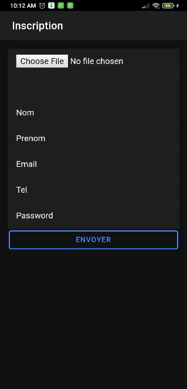
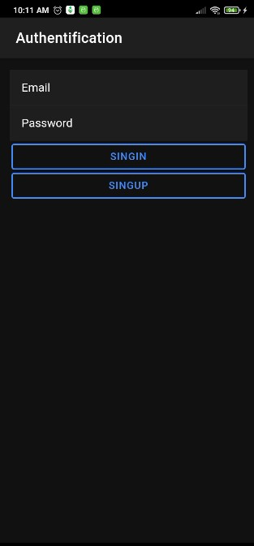
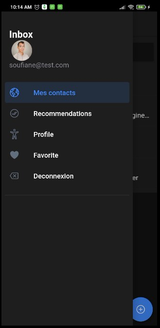
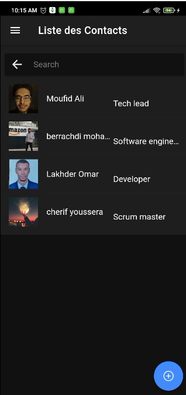
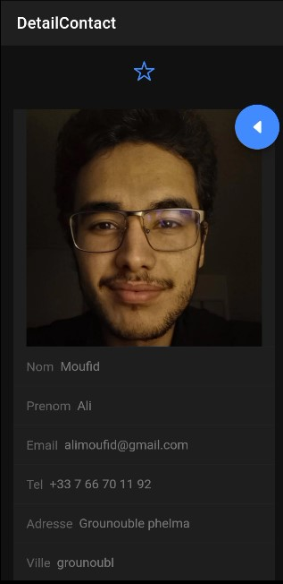
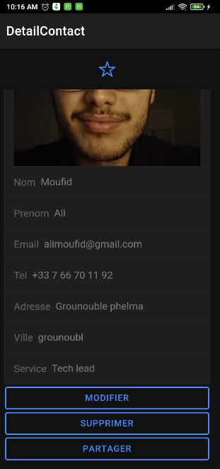
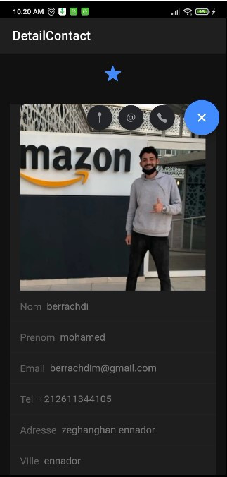
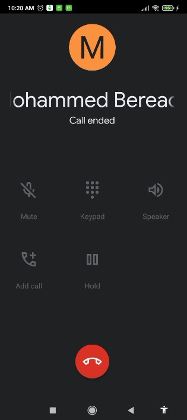
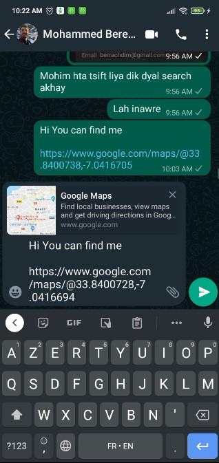

# Contact App
**Contacte App**
It is a cross-platform application developed with Ionic, Cordova, Angular, fireBase technologies **(As part of an academic project)**.
Our application provides its users with a telephone contact management, where the user can do the following activities:
1. Create your own account.
2. log in to your account.
3. add contacts and specify the service...
4. share a contact with the network.
5. add a contact as a favorite and have it local DATABASE.
6. manage profile.
7. contact a contact by phone or email.
8. share location with a contact>

## SignUp activity

## SignIn activity

 

## Menu

## Menu

## Personal Contacts

## Personal Contacts

## Details Of Contacts

## Favorite Contacts

## Recommended Contacts

## Contact Option

|                          **CallOption**                    | **Email Option**                                        | **Share Localisation Option**                                 |
|----------------------------------------------|--------------------------------------------------|-----------------------------------------------------------|
|  |  |  |

